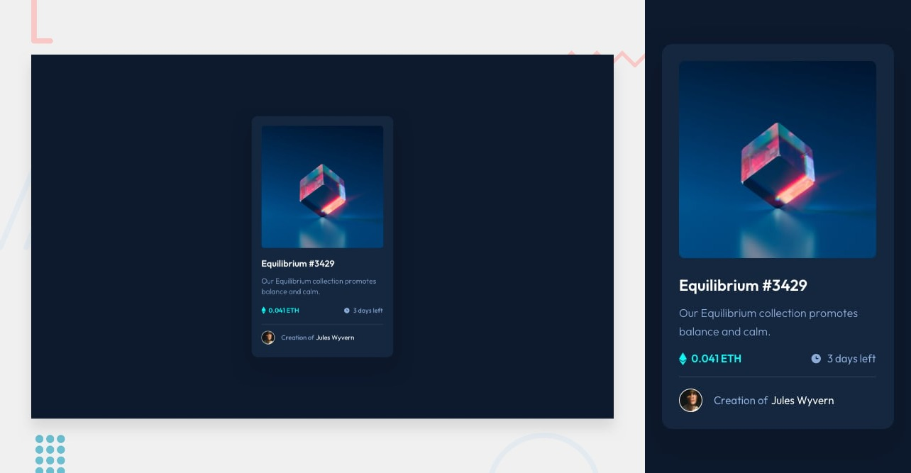

# Frontend Mentor - NFT preview card component solution

This is my solution to the [NFT preview card component challenge on Frontend Mentor](https://www.frontendmentor.io/challenges/nft-preview-card-component-SbdUL_w0U)

## The challenge

Users should be able to:

- View the optimal layout depending on their device's screen size
- See hover states for interactive elements

### Links

- Solution URL: [Add solution URL here](https://www.frontendmentor.io/challenges/nft-preview-card-component-SbdUL_w0U)
- Live Site URL: [Add live site URL here](https://jhon-okayda-nft-card.netlify.app/)

### Built with

- HTML5
- Tailwind-CSS

## Author

- Created by - okayda-jhon
